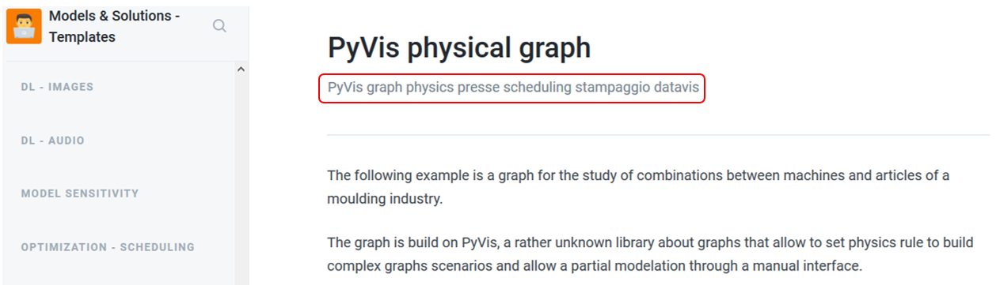
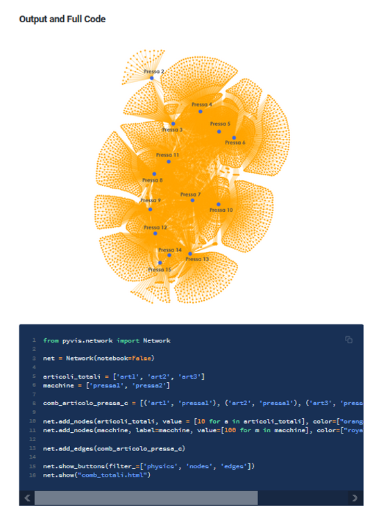

# Introduction

> If the implementation is hard to explain, it's a bad idea.
>
> _The Zen of Python,_ [_PEP 20_](https://www.python.org/dev/peps/pep-0020/#id2)\_\_

Welcome on board! Here's our area to manage pieces of code produced during projects and research, which can turn useful for the future ones.

This space is open and updatable, under specific guidelines.

## Guidelines

### Levels

The content of this space is managed according to the following structure:

* **Groups**: subjects' macro-areas \(e.g. _ML regression_, _ML classification_, ..., _Datavis_\);
* **Pages**: single codes. They can be linked to other pages, and are marked with tags;
* **Tags**: tag systems are key to the usefulness of the space. Tags are located into the description of the page, e.g.



and, most importantly, the keywords should be added under this structure:

* _library_
* _specific subject_
* _related group_

### Pages

The page is the proper space for the code. It is vital for it to be clear, well-organized, easily-searchable, immediately replicable. Thus, a page should be subjected to these rules.

#### Schema

Each page should be divided in sections following this schema:

* **First section**: it contains the full code, and a visual output where appropriate.
* **Second section**: it contains the code splitted and explained --whether it would be necessary-- in order to favor general understanding.

#### Runnability

Every template of code **must be runnable**: each type of data must be inserted --to simplify, they can be faked-- in order to understand what kind of objects and data structure is used, e.g.:

```python
from sklearn import tree
X = [[0, 0], [1, 1]]
Y = [0, 1]
clf = tree.DecisionTreeClassifier()
clf = clf.fit(X, Y)
```

#### Images

In case the code has a visual output \(e.g. a plot of any kind\), the image have to be shown at the beginning of the first section. 

If the data have been faked or simplified, it's not necessary for the plot to represent correctly those data, provided that the output remains clear enough.






#### Sub-pages

In case of long complex codes, a pages could be nested into sub-pages. 


Da aggiungere: esempio di template strutturato in più sotto-pagine


