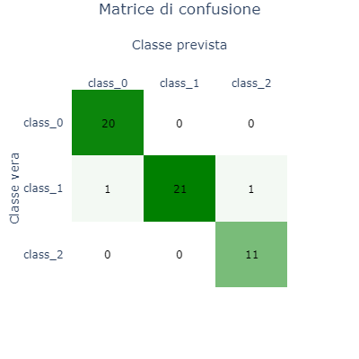
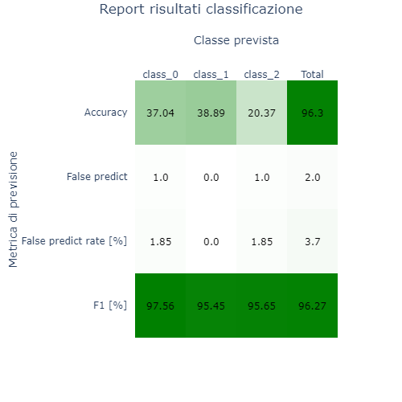

# Plotly Confusion Matrix

‌Outline code main purpose.

## Output and Full Code​

Paste output example of the code \(if necessary\), then the full code text.





```python
import plotly.figure_factory as ff
def plot_heatmap(df_heatmap, title='Heatmap', xaxis_title='', yaxis_title='', n_colors=1, figsize=500, filename=''):
    """
    Description

    Parameters
    ----------
    df_heatmap : pandas DataFrame
    title : string, default 'Heatmap'
        Plot title
    xaxis_title : string, default ''
        Name of the x axis
    yaxis_title : string, default ''
        Name of the y axis
    n_colors : {1, 2, 3}, default 1
        Number of colors to use in the Heatmap
    figsize : int, default 500
        Dimension of the square image (figsize, figsize)
    filename : string, default ''
        Name of the filaname. If filename != '' then the image 
        is saved with the filename specified. 
        Supported formats:
        - png (static image)
        - html (interactive image)

    Returns
    -------
    Plotly image
    """
    if n_colors == 1:
        colorscale = [[0, 'white'], [1, 'green']]
        font_colors = ['black', 'black']
    elif n_colors == 2:
        colorscale = [[0, 'lightblue'], [1, 'red']]
        font_colors = ['black', 'black']
    elif n_colors == 3:
        colorscale = [[0, 'lightblue'], [.5, 'white'], [1, 'red']]
        font_colors = ['black', 'black', 'black']
    fig = ff.create_annotated_heatmap(np.round(df_heatmap.values[::-1],2), 
                                      x = list(df_heatmap.columns),
                                      y = list(df_heatmap.index)[::-1],
                                      colorscale=colorscale, font_colors=font_colors)


    fig.update_layout(
        autosize=False,
        width=figsize,
        height=figsize,
        title={'text':title,'x':.5,'y':.99},
        xaxis_title=xaxis_title,
        yaxis_title=yaxis_title,
    )

    if filename.endswith('.html'):
        fig.write_html(filename)
    elif filename.endswith('.png'):
        fig.write_image(filename)

    fig.show()


import plotly.figure_factory as ff
import pandas as pd, numpy as np, xgboost as xgb

from sklearn.datasets import load_wine
from sklearn.model_selection import train_test_split

from sklearn.metrics import confusion_matrix
from sklearn.metrics import f1_score

data = load_wine()
X, Y = data['data'], data['target']
target_names = data['target_names']
X = pd.DataFrame(X,columns=data['feature_names'])
df = X.copy()
df['wine'] = Y

X_train, X_test, Y_train, Y_test = train_test_split(X, Y, test_size=0.3)


model = xgb.XGBClassifier()
model = model.fit(X_train, Y_train)

P_test = model.predict(X_test)


df_conf = pd.DataFrame(confusion_matrix(Y_test, P_test), columns=target_names, index=target_names)
N = df_conf.sum().sum()

df_empty = pd.DataFrame([[np.nan for t in target_names]], index=[''], columns=target_names)

df_acc = pd.DataFrame([[df_conf.loc[t,t] for t in target_names]], index=['Accuracy'], columns=target_names)
df_acc['Total'] = df_acc.sum().sum()
df_acc = 100 * df_acc / N

df_fp = pd.DataFrame([[df_conf.loc[set(target_names)-set([t]),t].sum() for t in target_names]], index=['False predict'], columns=target_names)
df_fp['Total'] = df_fp.sum().sum()

df_fpr = 100 * df_fp / N
df_fpr.rename(index={'False predict':'False predict rate [%]'}, inplace=True)

df_f1 = 100 * pd.DataFrame(f1_score(Y_test, P_test, average=None).reshape(1,-1), index=['F1 [%]'], columns=target_names)
df_f1['Total'] = 100 * f1_score(Y_test, P_test, average='weighted')

df_res = pd.concat([df_acc, df_fp, df_fpr, df_f1], 0, sort=False)


plot_heatmap(df_conf, title='Matrice di confusione', figsize=400, xaxis_title='Classe prevista', yaxis_title='Classe vera')

plot_heatmap(df_res,title='Report risultati classificazione', xaxis_title='Classe prevista', yaxis_title='Metrica di previsione')
```

## Details

Some detail here...

### Step by step procedure

* Step 1

  ```python
  import numpy as np
  ```

* Step 2

  ```python
  x = np.random.random()
  ```

* Step 3

  ```python
  print(x)
  ```

## Final thoughts / recommendation

Use this at your own risk!

