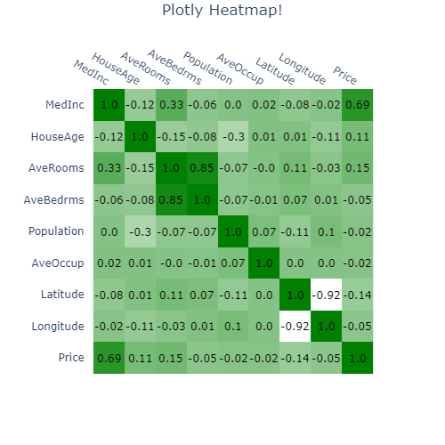

# Plotly Heatmap function

‌Create an Heatmap plot with Plotly library. The code is organized as a function which allow to create several different Heatmaps.

## Output and Full Code​



```python
import plotly.figure_factory as ff
import pandas as pd, numpy as np
from sklearn.datasets import fetch_california_housing

data = fetch_california_housing()
X, Y = data['data'], data['target']
X = pd.DataFrame(X,columns=data['feature_names'])
df = X.copy()
df['Price'] = Y


def plot_heatmap(df_heatmap, title='Heatmap', xaxis_title='', yaxis_title='', n_colors=1, figsize=500, filename=''):
    """
    Description

    Parameters
    ----------
    df_heatmap : pandas DataFrame
    title : string, default 'Heatmap'
        Plot title
    xaxis_title : string, default ''
        Name of the x axis
    yaxis_title : string, default ''
        Name of the y axis
    n_colors : {1, 2, 3}, default 1
        Number of colors to use in the Heatmap
    figsize : int, default 500
        Dimension of the square image (figsize, figsize)
    filename : string, default ''
        Name of the filaname. If filename != '' then the image 
        is saved with the filename specified. 
        Supported formats:
        - png (static image)
        - html (interactive image)

    Returns
    -------
    Plotly image
    """
    if n_colors == 1:
        colorscale = [[0, 'white'], [1, 'green']]
        font_colors = ['black', 'black']
    elif n_colors == 2:
        colorscale = [[0, 'darkred'], [1, 'green']]
        font_colors = ['black', 'black']
    elif n_colors == 3:
        colorscale = [[0, 'darkred'], [.5, 'white'], [1, 'green']]
        font_colors = ['black', 'black', 'black']
    fig = ff.create_annotated_heatmap(np.round(df_heatmap.values[::-1],2), 
                                      x = list(df_heatmap.columns),
                                      y = list(df_heatmap.index)[::-1],
                                      colorscale=colorscale, font_colors=font_colors)


    fig.update_layout(
        autosize=False,
        width=figsize,
        height=figsize,
        title={'text':title,'x':.5,'y':.99},
        xaxis_title=xaxis_title,
        yaxis_title=yaxis_title,
    )

    if filename.endswith('.html'):
        fig.write_html(filename)
    elif filename.endswith('.png'):
        fig.write_image(filename)

    fig.show()

plot_heatmap(df.corr(), title='Plotly Heatmap!')
```

## Details

The code is structured to be independent using the california\_housing dataset embedded in sklearn library. The ourput will be a Plotly interactive image. The code is structured as a function ready to be used.

Let's see how the code is organized step but step.

### Step by step procedure

* Step 1. Importing the libraries

  ```python
  import plotly.figure_factory as ff
  import pandas as pd, numpy as np
  from sklearn.datasets import fetch_california_housing
  ```

* Step 2. Importing data from sklearn. We will use california housing dataset. We gather inputs and output into a unique DataFrame which will be used to test 

  ```python
  data = fetch_california_housing()
  X, Y = data['data'], data['target']
  X = pd.DataFrame(X,columns=data['feature_names'])
  df = X.copy()
  df['Price'] = Y
  ```

* Step 3

  ```python
  print(x)
  ```

* Step 4

  ```python
  print(x)
  ```

* Step 5

  ```python
  print(x)
  ```

## Final thoughts / recommendation

Use this at your own risk!

